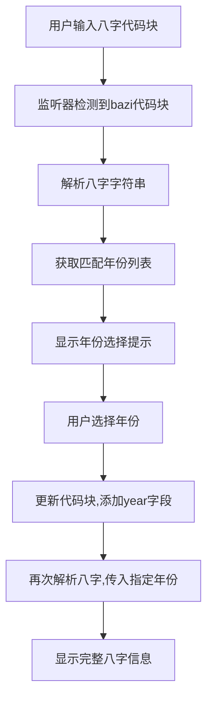

# 八字代码块自动提示年份功能实现计划

## 目标
在Obsidian中实现当用户输入八字代码块（格式如```bazi\nbazi: 丁卯 庚戌 乙卯 辛巳\n```）后，自动提示可能的年份供用户选择，并在用户选择后将年份补充到代码块中（添加`year`字段），然后反推八字的其他信息。

## 实现步骤

1. **监听代码块输入**：
   - 在Obsidian插件中添加一个监听器，检测用户输入的代码块是否为`bazi`类型。
   - 当检测到`bazi`代码块时，解析其中的八字字符串。

2. **调用现有服务获取年份列表**：
   - 使用`BaziService.parseBaziString`方法解析八字字符串，获取`matchingYears`列表。

3. **显示年份选择提示**：
   - 在代码块下方或通过弹出窗口显示可能的年份列表，供用户选择。

4. **更新代码块**：
   - 用户选择年份后，将所选年份添加到代码块中，格式为`year: 选中年份`。

5. **反推八字信息**：
   - 使用选定的年份再次调用`BaziService.parseBaziString`方法，传入`specifiedYear`参数，获取完整的八字信息。
   - 显示或更新八字命盘视图，展示反推结果。

## 技术实现细节

- **文件修改**：
  - 需要修改或创建文件来实现代码块监听和年份提示功能。可能需要修改`main.ts`或创建一个新文件来处理代码块事件。
  - 修改`BaziParserModal.ts`或相关文件，添加年份选择界面逻辑。

- **代码逻辑**：
  - 在`main.ts`中注册一个事件监听器，监听编辑器变化，检测`bazi`代码块。
  - 使用正则表达式匹配代码块内容，提取八字字符串。
  - 调用`BaziService.parseBaziString`获取`matchingYears`，并通过UI组件（如下拉菜单或弹出框）展示给用户。
  - 用户选择年份后，更新代码块内容，添加`year`字段。
  - 再次调用解析方法，传入所选年份，获取完整八字信息并更新视图。

## Mermaid流程图



## 问题与解决方案

- **如何监听代码块输入**：Obsidian API提供了编辑器事件监听功能，可以通过`editor.registerEvent`注册事件监听器。
- **如何显示年份选择提示**：可以使用Obsidian的`Modal`或自定义UI组件在代码块附近显示年份列表。
- **如何更新代码块**：通过Obsidian的编辑器API（如`editor.replaceRange`）更新代码块内容。

## 后续步骤

- 根据此计划在`Code`模式下进行具体实现，修改或创建必要文件，编写代码逻辑。
- 实现后，将测试功能是否符合用户需求，确保年份提示和八字信息反推准确无误。